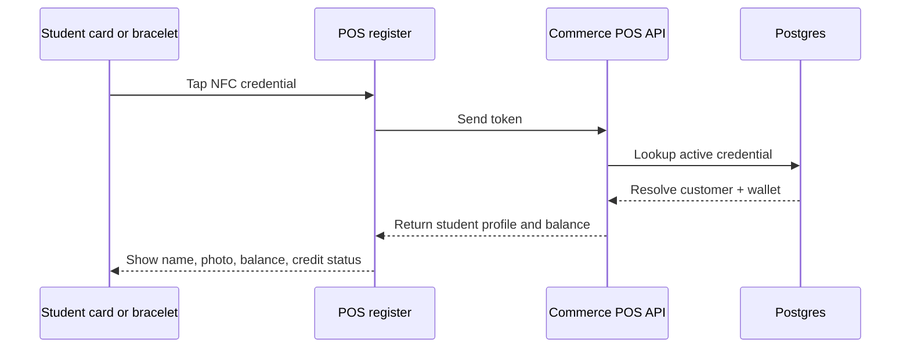

# Student Credential Model

This describes the identifier used when a student taps an NFC card, bracelet, or
scans a backup barcode or QR code.

The credential is not the student record. It is only a lookup key that resolves to a
student/customer inside Commerce POS.

## Why This Needs Its Own Table

One student can have more than one credential:

- an NFC card
- a wristband
- a barcode backup
- a QR code backup

One credential should only belong to one student at a time.

## Recommended Database Shape

```text
commerce_student_credentials
  id
  organization_id
  customer_id
  wallet_account_id
  credential_type
  credential_token_hash
  credential_label
  active
  issued_at
  revoked_at
  last_used_at
  metadata
```

Suggested fields:

| Field | Purpose |
| --- | --- |
| `organization_id` | Tenant scope |
| `customer_id` | The student/customer the credential belongs to |
| `wallet_account_id` | Optional direct pointer to the wallet for faster lookup |
| `credential_type` | `nfc_card`, `nfc_wristband`, `barcode`, `qr_code`, `manual_pin` |
| `credential_token_hash` | Hashed opaque token stored on the card, band, or backup code |
| `credential_label` | Human label like `Blue Band` or `Card 04` |
| `active` | Lets staff disable a lost or replaced credential |
| `issued_at` | When it was created |
| `revoked_at` | When it was disabled |
| `last_used_at` | Useful for auditing and support |
| `metadata` | Vendor, chip type, color, notes |

## Important Rules

- Do not store the student name in the credential record as the source of truth.
- Do not treat the NFC tag UID as the only identity unless the hardware stack
  explicitly requires it.
- Prefer an opaque random token that the tag or code carries.
- Hash the token before storing it.
- Revoke the old credential if a child gets a replacement card or bracelet.

## Tap-To-Select Flow



## Register UI Behavior

When a credential is scanned, the register should:

- show the student name and photo
- show the signed wallet balance
- show a block warning only if the next sale would exceed the credit limit
- keep the rest of the checkout UI unchanged
- let cashiers re-scan another credential to switch students fast

If no credential matches:

- show `Unknown student`
- offer search by matricula/name as a fallback
- allow an admin to issue or link a credential later

## Parent Payment Flow

Parents should pay online against the same wallet account:

- parent opens the school portal
- parent tops up the wallet
- Commerce POS updates the wallet balance
- the next tap at the register shows the new balance

That keeps the payment path and the tap credential path separate.
