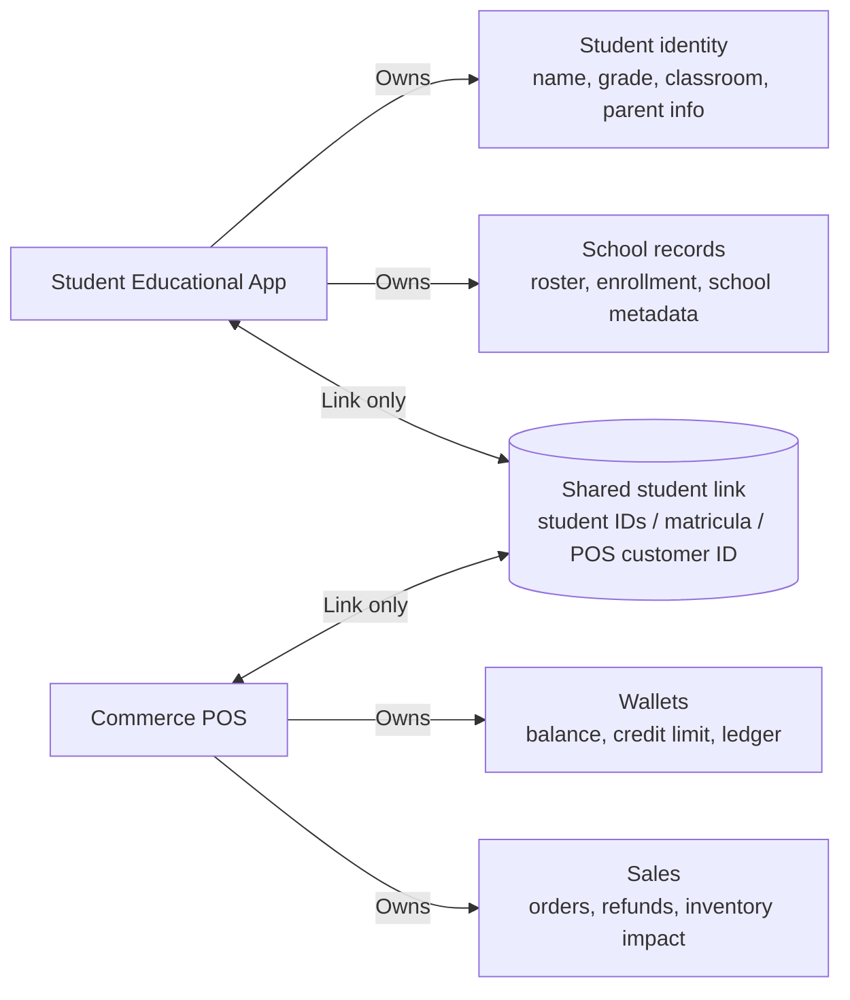
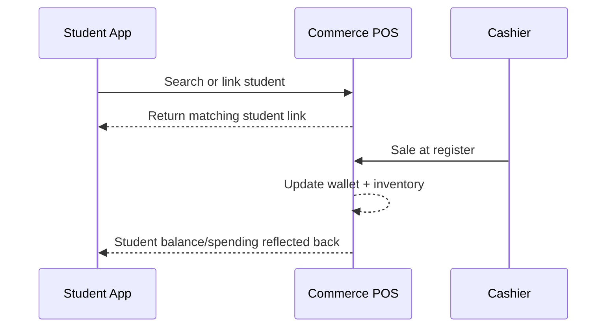
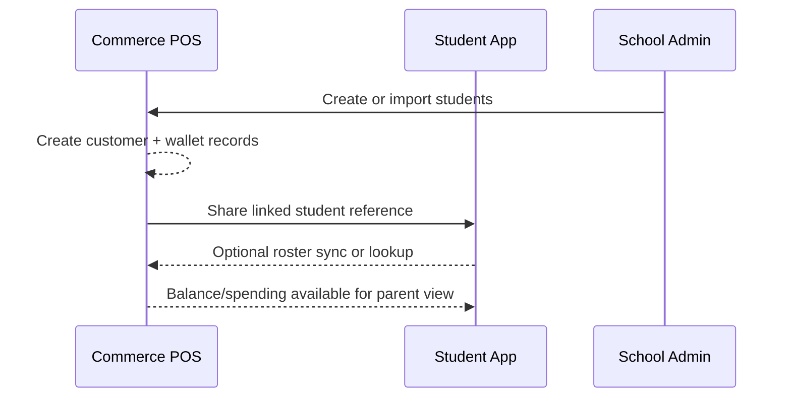

# Student and POS Integration Diagrams

This document shows the intended relationship between the Student Educational app and
Commerce POS.

The core rule is simple:

- Each system can run on its own.
- Each system can connect to another system through a link.
- One system should own each piece of data.
- Shared data should be linked, not duplicated.

## Ownership Model



## Student App First



Use this when the school already has the student roster in the Student App and wants
Commerce POS only for cafeteria spending.

## POS First



Use this when the school already has Commerce POS running and later adds the Student
App.

## What The Link Does

The link says these two records belong to the same child:

```text
Student App student.id
        ==
Commerce POS customer.external_student_id
        ==
Commerce POS wallet.customer_id
```

That lets either app operate independently while still recognizing the same student.

## What The Link Does Not Do

- It does not let both systems freely overwrite the same student fields.
- It does not duplicate balances in two places.
- It does not merge unrelated students by name alone.

## Compatible Third-Party Systems

Yes, the same pattern can work with another system that is not built by us, if that
system provides:

- stable student IDs or matricula values
- an API or import/export path
- a way to store an external link ID
- a clear owner for student identity
- a clear owner for wallet or spending data

If those conditions exist, Commerce POS can link to that system the same way it links
to the Student Educational app.

If the other system does not expose those pieces, then the connection becomes brittle
and duplicate records become likely.
